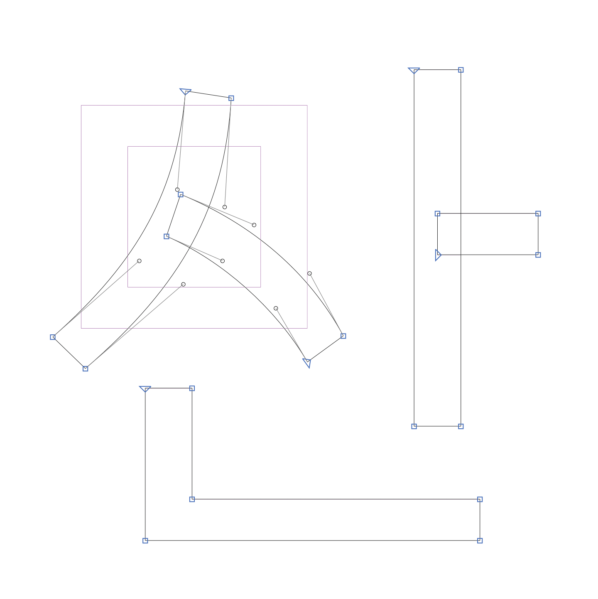
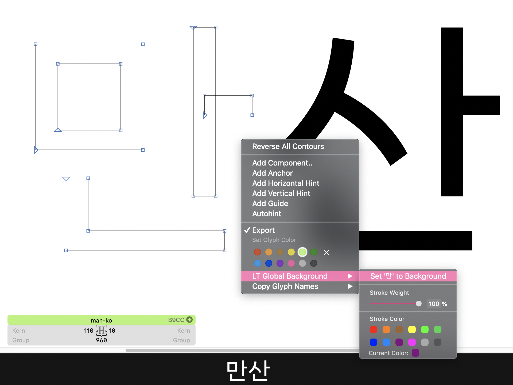

# Leedotype Global Background

You can find English version of this file [here](./ENGLISH.md).

특정 글립의 아웃라인을 배경에 가이드로 깔아놓고 볼 수 있는 플러그인입니다. 글립스 프로그램의 '플러그인 관리자'를 통해 설치 및 사용 가능합니다. 폰트랩 5의 '글로벌 마스크'와 비슷한 기능입니다.

## 설치 방법

1. `창` → `플러그인 관리자`에서 Leedotype Global Background를 검색하고 설치 버튼을 누릅니다.

2. 글립스를 재시작합니다.

## 사용 방법

1. 글립스 상단 메뉴의 `보기` → `LT Global Background 보기`를 체크합니다.

2. 배경에 깔아놓고 보고자 하는 글립을 선택합니다.

3. 마우스 오른쪽 버튼을 누르고 `LT Global Background`를 선택합니다.

4. `'글립' 글자를 배경으로 사용하기`를 선택합니다.

5. 하단 옵션에서 배경 가이드라인의 색상이나 두께를 커스터마이징할 수 있습니다.

## 라이센스

Copyright 2020 Leedotype Co., Ltd. (@leedotype)

## 문의

support@leedotype.com
